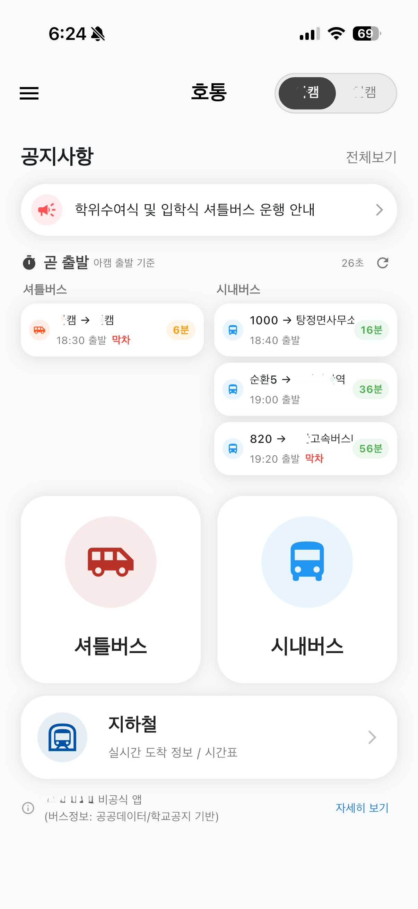

# 호통

호서대학교 통학 이동 정보를 한곳에서 보는 비공식 Flutter 앱입니다.  
셔틀버스, 시내버스, 지하철(1호선) 정보를 통합해 제공합니다.

| 앱 화면 |
|--------|
|  |

## 주요 기능

### 1) 홈
- 최신 공지 1건 요약 + 전체 공지 이동
- `곧 출발` 위젯으로 셔틀/시내버스 임박 운행 정보 표시
- 캠퍼스(아산/천안) 즉시 전환

### 2) 공지/긴급 공지
- 일반 공지: 최신 1건 + 목록 + 유형 필터
- 긴급 공지: 카테고리(셔틀/시내버스/지하철)별 배너 노출
- Markdown 본문 렌더링 및 외부 링크 이동

### 3) 셔틀버스
- 노선/날짜별 시간표 조회
- 회차별 정류장 도착 시각 조회
- 정류장 상세(설명/지도) 확인
- 내 위치 기반 주변 정류장 정렬 및 정류장별 시간표 조회

### 4) 시내버스
- 캠퍼스별 노선 그룹 화면 제공
- 실시간 운행 위치(WebSocket) 반영
- 노선 경로/정류장 데이터는 로컬 JSON 에셋 사용
- 노선별 다음 출발 시간 표시

### 5) 지하철(천안역/아산역)
- 실시간 도착 정보(WebSocket)
- 역/요일 유형별 시간표 조회 API 연동

## 기술 스택

- Framework: `Flutter`, `Dart`
- State Management / Navigation: `get`
- Network: `http`, `web_socket_channel`
- Map: `flutter_map`, `flutter_naver_map`, `latlong2`
- Local Storage: `shared_preferences`
- Location: `geolocator`
- UI/Utility: `intl`, `flutter_markdown`, `url_launcher`, `tutorial_coach_mark`

## 프로젝트 구조

```text
lib/
  main.dart
  models/                # 도메인 모델
  repository/            # API 접근 레이어
  utils/                 # 환경설정, 위치, 시간표 로더 등
  viewmodel/             # GetX ViewModel
  view/                  # 화면 및 공통 UI 컴포넌트
assets/
  bus_routes/            # 시내버스 노선 GeoJSON
  bus_stops/             # 시내버스 정류장 JSON
  bus_times/             # 시내버스 시간표 JSON(버전 관리)
  Holiday/               # 공휴일 데이터
  icons/
```
## 백엔드 [깃허브 링크](https://github.com/Recircle2000/Hotong_Fastapi)

`BASE_URL` 기준으로 아래 엔드포인트를 사용합니다.

- 공지: `/notices/`, `/notices/latest`
- 긴급 공지: `/emergency-notices/latest?category=...`
- 셔틀: `/shuttle/routes`, `/shuttle/schedules-by-date`, `/shuttle/stations` 등
- 시내버스: `/buses`, WebSocket `/ws/bus`
- 지하철: `/subway/schedule`, WebSocket `/subway/ws`

## 데이터 소스

- 시내버스 경로/정류장: 앱 내 에셋(JSON)
- 시내버스 시간표: `assets/bus_times/bus_times.json` 기본 사용
- 앱 시작 시 `BusTimesLoader`가 버전 API를 조회해 최신 파일로 교체 가능

## 참고

- 이 앱은 호서대학교 비공식 앱입니다.
- 위치 권한이 필요한 기능(주변 정류장/내 위치 표시)이 포함되어 있습니다.
